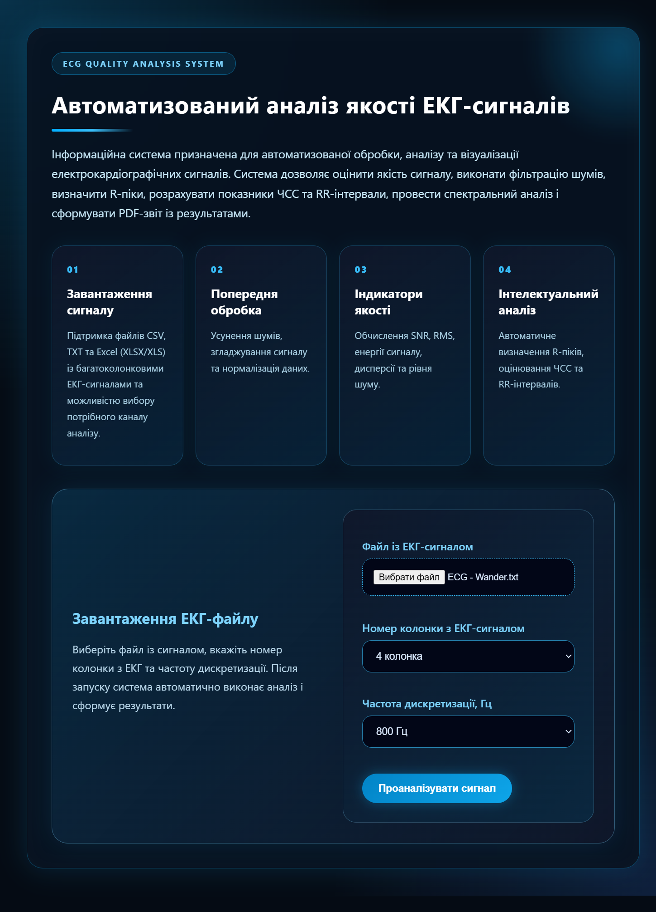
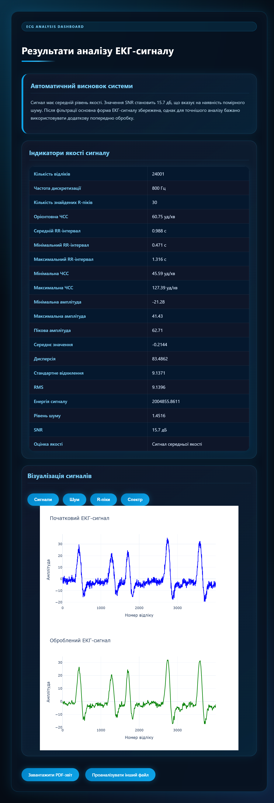
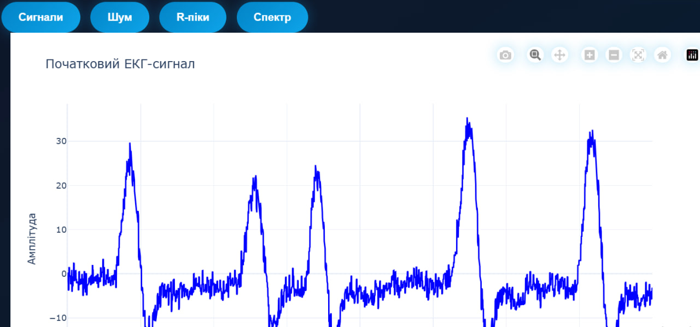
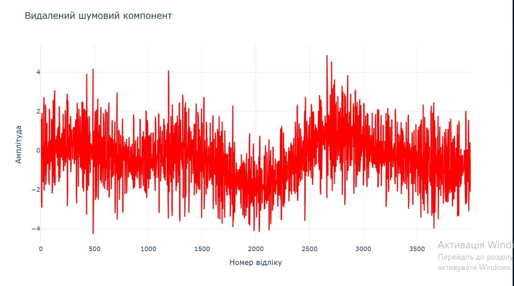
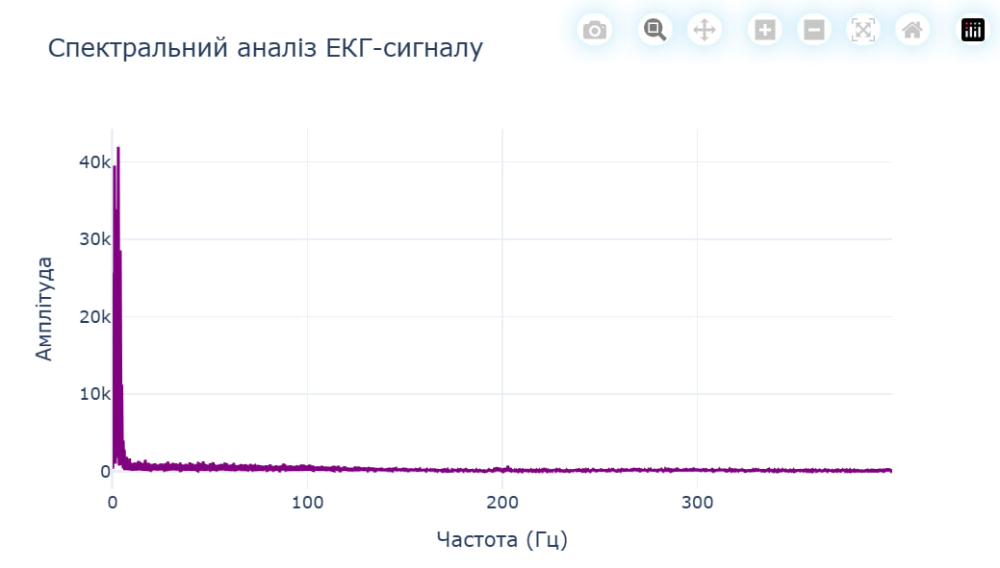
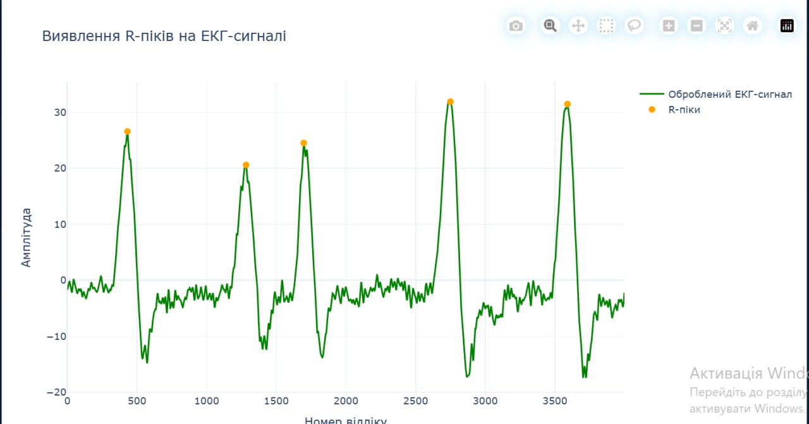

## 👤 Автор

- **ПІБ**: Прохніч Юлія Євгеніївна
- **Група**: ФЕІ-41
- **Керівник**: проф. Карбовник І.Д.
- **Дата виконання**: 26.05.2026 р.
---
## 📌Загальна інформація
- **Тип проєкту**: Вебзастосунок
- **Мова програмування**: Python
- **Фреймворки / Бібліотеки**:
  - Flask
  - NumPy
  - Pandas
  - SciPy
  - Plotly
  - ReportLab
  

---
## 🧠 Опис функціоналу

- 📂 Завантаження ЕКГ-сигналів у форматах CSV, TXT та Excel
- 📊 Вибір колонки сигналу для аналізу
- ⚙️ Вибір частоти дискретизації
- 🧹 Попередня обробка сигналу та усунення шумів
- 📈 Побудова графіків початкового та обробленого сигналу
- 🔍 Автоматичне визначення R-піків
- ❤️ Розрахунок ЧСС та RR-інтервалів
- 📉 Спектральний аналіз сигналу
- 📝 Формування автоматичного висновку щодо якості сигналу
- 📄 Генерація PDF-звіту

---

## 🧱 Опис основних файлів

| Файл | Призначення |
|------|-------------|
| `app.py` | Основний Flask-застосунок |
| `signal_loader.py` | Зчитування та перевірка ЕКГ-файлів |
| `preprocessing.py` | Попередня обробка сигналу |
| `quality_metrics.py` | Обчислення індикаторів якості |
| `visualization.py` | Побудова графіків сигналу |
| `pdf_report.py` | Генерація PDF-звіту |
| `index.html` | Головна сторінка застосунку |
| `results.html` | Сторінка результатів аналізу |
| `style.css` | Стилізація вебінтерфейсу |

---

## ▶️ Як запустити проєкт "з нуля" 

### 1. Встановлення інструментів

Для запуску проєкту необхідно встановити:

- Python 3.11+
- pip
- Git
- PyCharm або VS Code

---

### 2. Клонування репозиторію

```bash
git clone https://github.com/yuliaprohnichr/ecg_quality_system
cd ecg-quality-system
```

---

### 3. Створення віртуального середовища

```bash
python -m venv venv
```

---

### 4. Активація віртуального середовища

```bash
.\venv\Scripts\activate
```

Після активації в терміналі має з’явитися:

```bash
(venv)
```

---

### 5. Встановлення залежностей

```bash
pip install flask numpy pandas scipy plotly reportlab openpyxl kaleido
```

---

### 6. Запуск проєкту

```bash
python app.py
```

---

### 7. Відкриття системи у браузері

Після запуску в терміналі з’явиться адреса:

```text
http://127.0.0.1:5000
```

Її потрібно відкрити у браузері.

---

## 🔌 Основні можливості системи

### 📂 Завантаження сигналу

Система підтримує:

- CSV
- TXT
- XLSX
- XLS

Користувач може:
- обрати колонку сигналу;
- задати частоту дискретизації.

---

### 📊 Аналіз ЕКГ

Система автоматично:

- виконує попередню обробку сигналу;
- усуває шум;
- визначає R-піки;
- обчислює ЧСС;
- аналізує RR-інтервали;
- оцінює якість сигналу.

---

### 📈 Візуалізація

У системі реалізовано:

- графік початкового сигналу;
- графік обробленого сигналу;
- графік шумового компонента;
- спектральний аналіз;
- графік із виявленими R-піками.

---

### 📄 PDF-звіт

Після завершення аналізу система автоматично формує PDF-документ із:
- графіками;
- метриками;
- автоматичним висновком.

---

## 🖱️ Інструкція для користувача

1. Відкрити головну сторінку системи.
2. Завантажити файл із ЕКГ-сигналом.
3. Вибрати номер колонки сигналу.
4. Вказати частоту дискретизації.
5. Натиснути кнопку:
   - `Проаналізувати сигнал`
6. Переглянути результати аналізу.
7. За потреби завантажити PDF-звіт.

---

## 📷 Приклади / скриншоти

- Головна сторінка системи

- Сторінка результатів аналізу

- Вкладки з графіками




- PDF-звіт


---

## 🧪 Проблеми і рішення

| Проблема | Рішення |
|----------|----------|
| Flask не запускається | Перевірити встановлення бібліотек |
| Не відкривається Excel-файл | Встановити openpyxl |
| Не генерується PDF | Встановити kaleido |
| Помилка під час аналізу | Перевірити правильність колонки сигналу |
| Порожні графіки | Перевірити дані у файлі |

---

## 🧾 Використані джерела / література

- Flask Documentation
- Plotly Documentation
- NumPy Documentation
- Pandas Documentation
- SciPy Documentation
- ReportLab Documentation
- PhysioNet ECG Database
- StackOverflow


